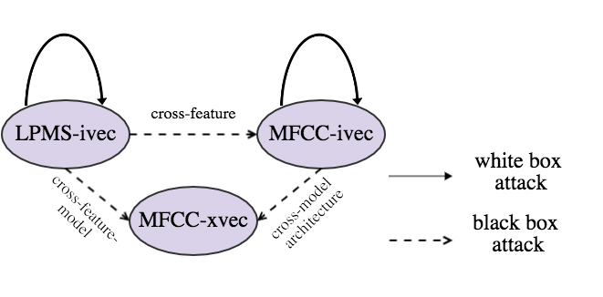
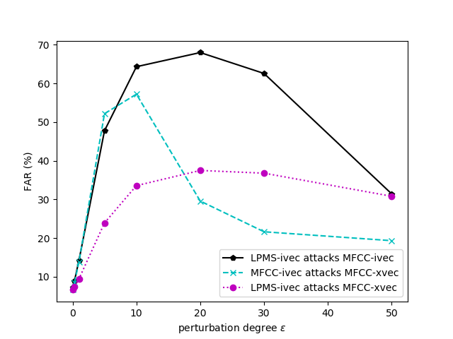

# adversarial-attack-on-GMM-i-vector-based-speaker-verification-systems
This repository provides the coding implementation of the paper:
[Adversarial Attacks on GMM i-vector based Speaker Verification Systems](https://arxiv.org/abs/1911.03078).

## Adversarial Attack Configuration


## Results

### Adversarial audio samples & system responses

- Listen to audio samples at webpage: https://lixucuhk.github.io/adversarial-samples-attacking-ASV-systems


### White box attacks

1. FAR (%) of the GMM i-vector systems under white box attack with different perturbation degrees (\epsilon).

|           | \epsilon=0 | \epsilon=0.3 | \epsilon=1.0 | \epsilon=5.0 | \epsilon=10.0 |
| --------- | ------------ | -------------- | -------------- | -------------- | --------------- |
| MFCC-ivec |     7.20     |      82.91     |      96.87     |      18.14     |      16.65      |
| LPMS-ivec |    10.24     |      96.78     |      99.99     |      99.64     |      69.95      |

2. EER (%) of the GMM i-vector systems under white box attack with different perturbation degrees (&epsilon).

|           | \epsilon=0 | \epsilon=0.3 | \epsilon=1.0 | \epsilon=5.0 | \epsilon=10.0 |
| --------- | ------------ | -------------- | -------------- | -------------- | --------------- |
| MFCC-ivec |     7.20     |      81.78     |      97.64     |      50.25     |      50.72      |
| LPMS-ivec |    10.24     |      94.04     |      99.95     |      99.77     |      88.60      |

### Black box attacks

1. EER (%) of the target systems under black box attack with different perturbation degrees (\epsilon).

|                             | \epsilon=0 | \epsilon=0.3 | \epsilon=1.0 | \epsilon=5.0 | \epsilon=10.0 | \epsilon=20.0 | \epsilon=30.0 | \epsilon=50.0 |
| --------------------------- | ------------ | -------------- | -------------- | -------------- | --------------- | --------------- | --------------- | --------------- |
| LPMS-ivec attacks MFCC-ivec |     7.20     |       8.83     |      13.82     |      50.02     |      69.04      |      74.62      |      74.59     |      63.24      |
| MFCC-ivec attacks MFCC-xvec |     6.62     |       8.52     |      14.06     |      57.43     |      74.32      |      60.85      |      54.07     |      51.34      |
| LPMS-ivec attacks MFCC-xvec |     6.62     |       7.42     |       9.49     |      25.47     |      37.51      |      43.89      |      48.48     |      48.39      |

2. FAR (%) of the target systems under black box attack with different perturbation degrees (\epsilon).


## Dependencies

1. Python and packages

    This code was tested on Python 3.7.1 with PyTorch 1.0.1.
    Other packages can be installed by:

    ```bash
    pip install -r requirements.txt
    ```

2. Kaldi-io-for-python

    kaldi-io-for-python is used for reading data of `ark,scp` format in kaldi via python codes.
    See `README.md` in [kaldi-io-for-python](https://github.com/vesis84/kaldi-io-for-python) for installation.

## Prepare Dataset

1. Download Voxceleb1 dataset

    To replicate the paper's work, get Voxceleb1 dataset at http://www.robots.ox.ac.uk/~vgg/data/voxceleb/vox1.html.
    It consists of short clips of human speech, and there are in total 148,642 utterances for 1251 speakers. Consistent with [Nagrani et al.](https://arxiv.org/abs/1706.08612), 4874 utterances for 40 speakers are reserved for testing. The remaining utterances are used for training our SV models.


## Train ASV models
- In our experiments, three ASV models are well trained: Mel-frequency cepstral coefficient (MFCC) based GMM i-vector system (`MFCC-ivec`), log power magnitude spectrum (LPMS) based GMM i-vector system (`LPMS-ivec`) and MFCC based x-vector system (`MFCC-xvec`). 
- You can execute the `run.sh` script in the directory of `i-vector-mfcc`, `i-vector-lpms` and `x-vector-mfcc` to train `MFCC-ivec`, `LPMS-ivec` and `MFCC-xvec`, respectively. These codes were modified from [Kaldi scripts](https://github.com/kaldi-asr/kaldi/tree/master/egs/voxceleb). You need to go into the correponding directory, and run the `run.sh`. For e.g.,
  ```bash
  cd i-vector-mfcc
  ./run.sh
  ```

## Perform Adversarial Attacks
- According to the attack configuration, two white box attacks are performed on `MFCC-ivec` and `LPMS-ivec`, respectively. Three black box attack settings are: `LPMS-ivec attacks MFCC-ivec`, `MFCC-ivec attacks MFCC-xvec` and `LPMS-ivec attacks MFCC-xvec`.


- To leverage Pytorch to automatically generate the adversarial gradients, we rebuild the forward process in ASV systems by Pytorch, using the models trained via Kaldi scripts. Before executing the codes, you need to copy `i-vector-mfcc/copy-ivectorextractor.cc` to `
/your_path/kaldi/src/ivectorbin/copy-ivectorextractor.cc` and compile it. This code is used to convert i-vector extractor parameters into `txt` format.


- To generate adversarial samples from `LPMS-ivec` and perform the white box attack on it, run:
  ```bash
  cd i-vector-lpms
  ./perform_adv_attacks.sh
  ```

- To generate adversarial samples from `MFCC-ivec`, perform the white box attack on it and black box attack of `LPMS-ivec attacks MFCC-ivec`, run:
  ```bash
  cd i-vector-mfcc
  ./perform_adv_attacks.sh
  ```

- To perform black box attack of `MFCC-ivec attacks MFCC-xvec` and `LPMS-ivec attacks MFCC-xvec`, run:
  ```bash
  cd x-vector-mfcc
  ./spoofing_MFCC_xvec.sh
  ```

## Citation
If the code is used in your research, please star our repo and cite our paper as follows:
```
@article{li2019adversarial,
  title={Adversarial attacks on GMM i-vector based speaker verification systems},
  author={Li, Xu and Zhong, Jinghua and Wu, Xixin and Yu, Jianwei and Liu, Xunying and Meng, Helen},
  journal={arXiv preprint arXiv:1911.03078},
  year={2019}
}
```

## Contact

- [Xu Li](https://lixucuhk.github.io/) at the Chinese University of Hong Kong (xuli@se.cuhk.edu.hk, xuliustc1306@gmail.com)
- If you have any questions or suggestions, please feel free to contact Xu Li via xuli@se.cuhk.edu.hk or xuliustc1306@gmail.com.

<!-- ## License

Apache License 2.0

This repository contains codes adapted/copied from the followings:
- [utils/adabound.py](./utils/adabound.py) from https://github.com/Luolc/AdaBound (Apache License 2.0)
- [utils/audio.py](./utils/audio.py) from https://github.com/keithito/tacotron (MIT License)
- [utils/hparams.py](./utils/hparams.py) from https://github.com/HarryVolek/PyTorch_Speaker_Verification (No License specified)
- [utils/normalize-resample.sh](./utils/normalize-resample.sh.) from https://unix.stackexchange.com/a/216475 -->
